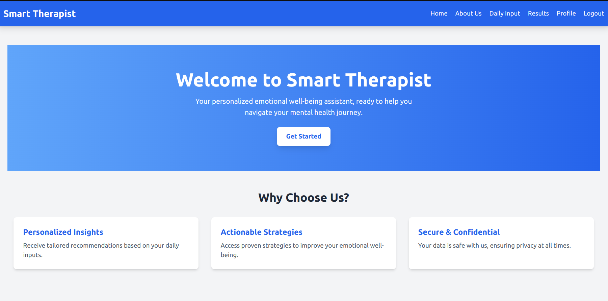
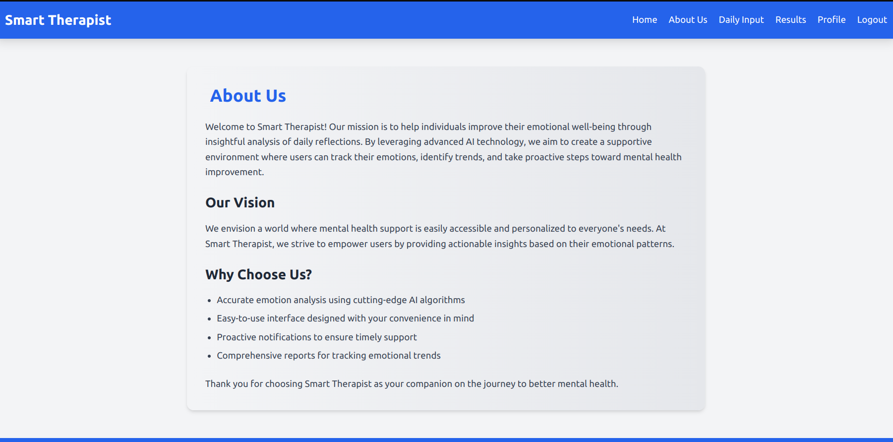
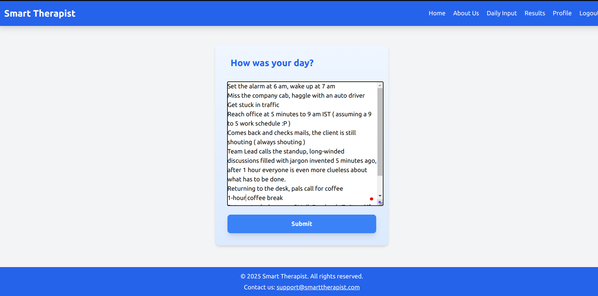
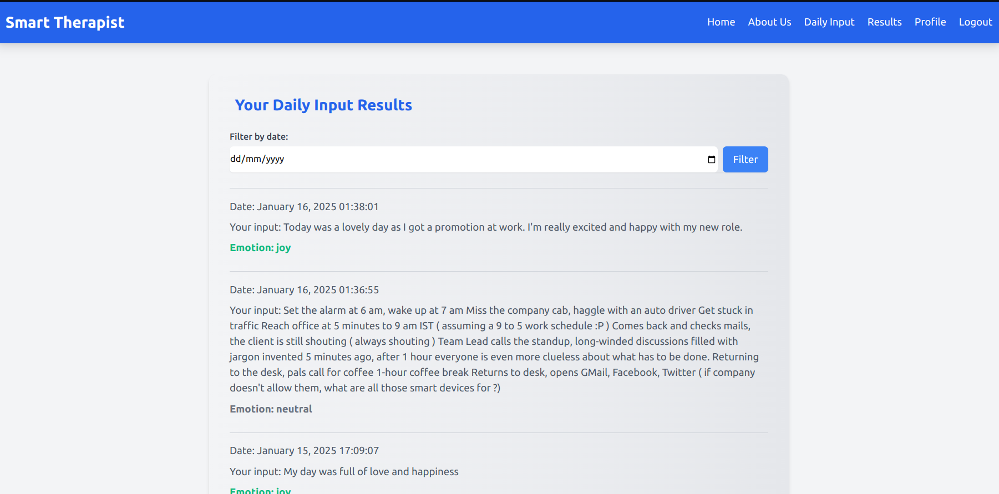
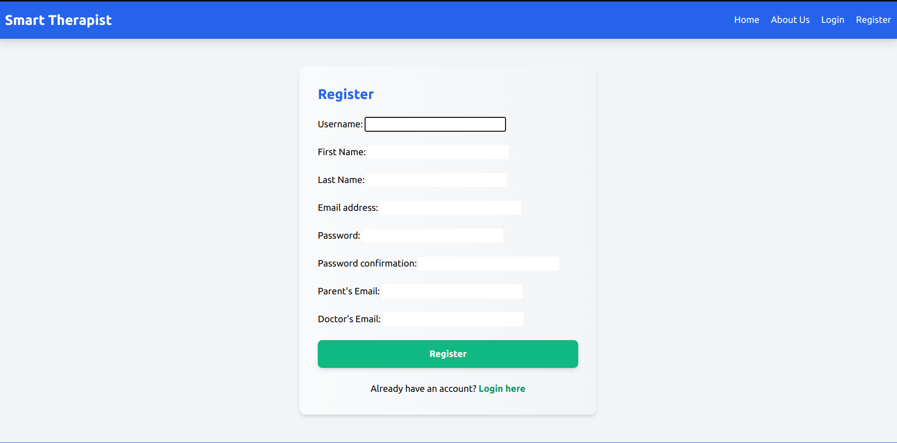
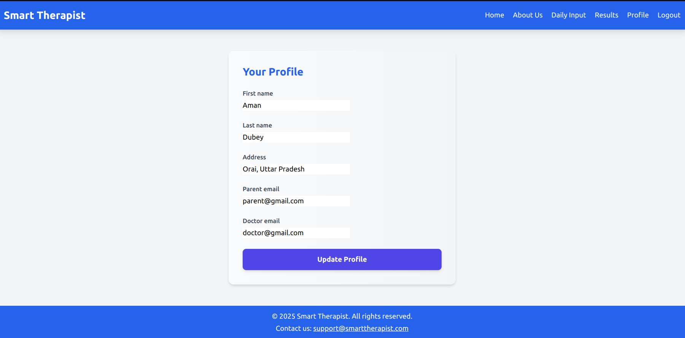

# Smart Therapist

Smart Therapist is a Django-based web application designed to help individuals track their emotional well-being through daily reflections. By leveraging advanced AI-powered emotion analysis, the platform provides users with actionable insights to improve mental health.

It asks users "How was your day?" and analyzes the sentiment of their responses. If a user exhibits negative emotions for three consecutive days, the system sends an email notification to their parents and doctor.

---

## Features

-   **Daily Input**: Users can submit daily reflections to record their emotional state.
-   **Emotion Analysis**: Leverages AI models to classify emotions in user inputs.
-   **Streak Notifications**: Sends email alerts to parents and doctors if a user shows a consecutive pattern of negative emotions.
-   **Profile Management**: Users can update their personal information and linked contacts (parent and doctor emails).
-   **Results Tracking**: Users can filter and review past inputs and emotions.

---

## Screenshots

Below are some screenshots of the Recipe App:

### Home Page



### About Page



### Daily Input Page



### Results Page



### Register Page



### Profile Page



---

## Installation

### Prerequisites

-   Python 3.8+
-   pip (Python package manager)
-   Virtual environment (recommended)

### Steps

1. **Clone the Repository**:

    ```bash
    git clone https://github.com/imunreal7/smart_therapist
    cd smart-therapist
    ```

2. **Create a Virtual Environment**:

    ```bash
    python -m venv venv
    source venv/bin/activate  # On Windows, use venv\Scripts\activate
    ```

3. **Install Dependencies**:

    ```bash
    pip install -r requirements.txt
    ```

4. **Run Migrations**:

    ```bash
    python manage.py migrate
    ```

5. **Create a Superuser** (for admin access):

    ```bash
    python manage.py createsuperuser
    ```

6. **Run the Development Server**:

    ```bash
    python manage.py runserver
    ```

    Visit `http://127.0.0.1:8000/` in your browser.

---

## Configuration

### Environment Variables

Create a `.env` file in the project root and configure the following variables:

```
DEBUG=True
SECRET_KEY=<your-secret-key>
EMAIL_BACKEND='django.core.mail.backends.smtp.EmailBackend'
EMAIL_HOST=<smtp-host>
EMAIL_PORT=<smtp-port>
EMAIL_USE_TLS=True
EMAIL_HOST_USER=<your-email>
EMAIL_HOST_PASSWORD=<your-password>
```

### AI Model

The application uses the Hugging Face `j-hartmann/emotion-english-distilroberta-base` model for emotion classification. Ensure your system meets the requirements for Transformers.

---

## Usage

### Daily Reflections

1. Register and log in to your account.
2. Submit your daily reflections on the "Daily Input" page.
3. View the AI-analyzed results under "Results".

### Profile Management

1. Update your profile with your parent's and doctor's email addresses.
2. Save changes to ensure proper notifications.

---

## Author

Developed by Aman Dubey.

